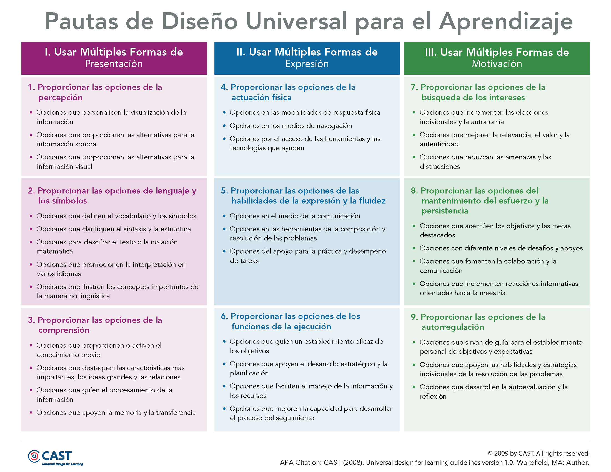
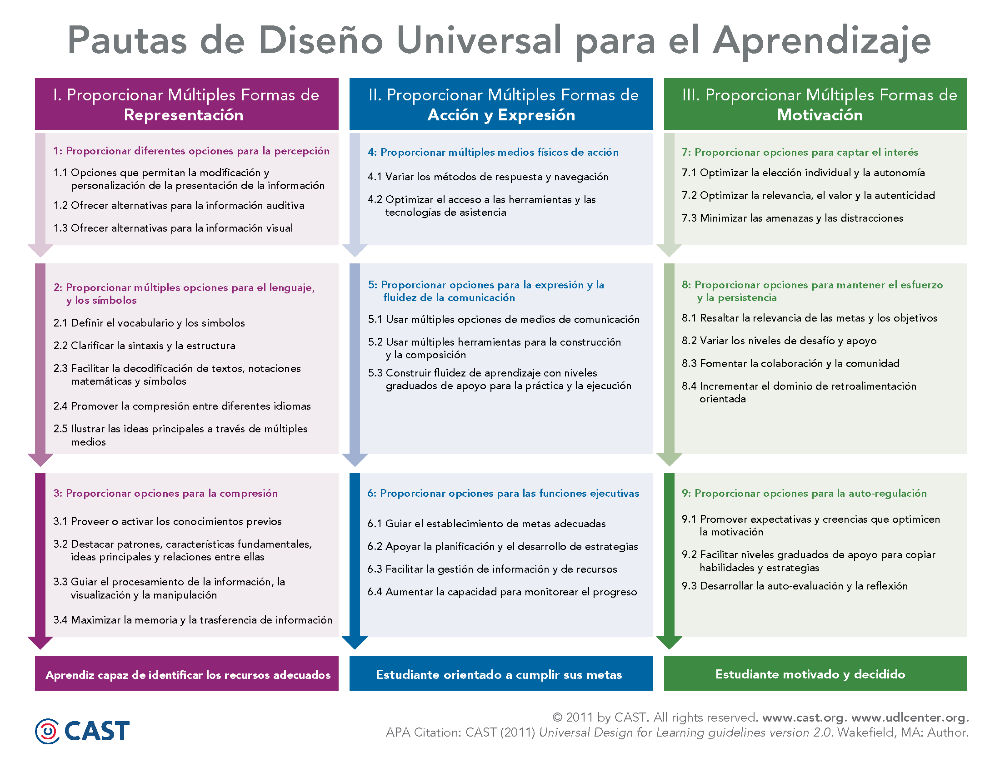
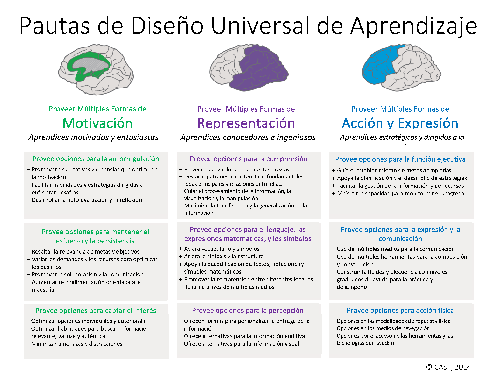
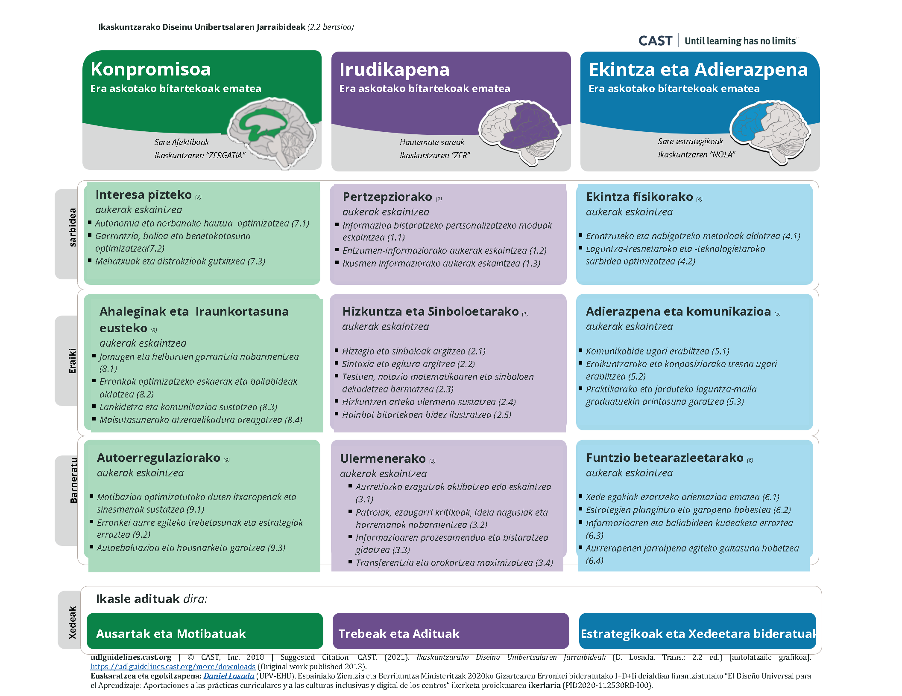
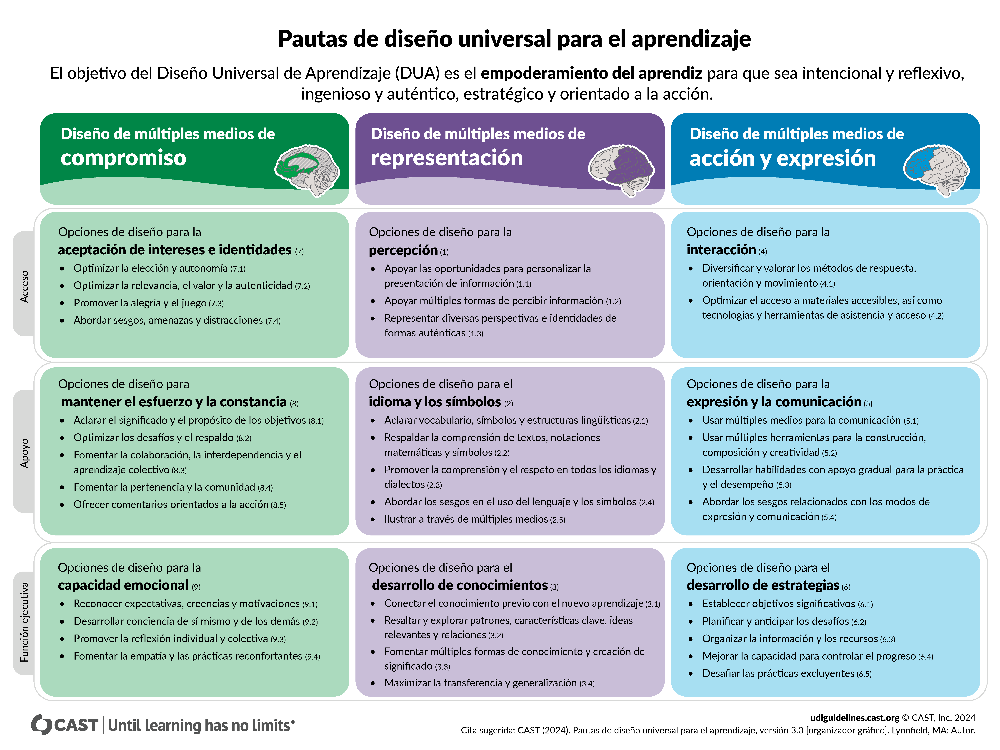

## Sarrera

Ikaskuntzarako Diseinu Unibertsala (IDU)
: Hezkuntza inklusiboa garatzeko erreferentzia-esparrua, ikasleen aniztasuna kontuan hartuta irakaskuntza eta ikaskuntza prozesuak modu malgu, irisgarri eta eskuragarrian diseinatzea helburu duena [@alba2022ensenar; @cast2024c].

Ikaskuntzarako Diseinu Unibertsala (IDU) hezkuntza inklusiboa garatzeko erreferentzia-esparru nagusietako bat da, ikasleen aniztasuna abiapuntu hartzen duena. Ikuspegi honen arabera, irakaskuntza eta ikaskuntza prozesuak modu malgu eta eskuragarrian diseinatu behar dira, ikasle guztiek parte hartzeko eta aurrera egiteko aukera izan dezaten. Horrela, IDUk hezkuntza ulertzeko paradigma-aldaketa bat proposatzen du, non sistemak berak egokitu behar duen ikasleen beharretara, eta ez alderantziz.

Ildo horretan, Ikaskuntzarako Diseinu Unibertsala ikuspegi pedagogiko eta zientifiko gisa ulertzen da, irakaskuntza inklusiboa bermatzeko tresna gisa. Ikasleen arteko aldakortasuna oinarrizko printzipiotzat hartzen du, eta, ondorioz, curriculumaren diseinua zein gelako jarduna egokitzeko aukera ematen du, ikasle guztien parte-hartzea eta ikaskuntza sustatzeko. Ikuspegi hori bereziki azpimarratzen da literaturan, non IDU hezkuntza-praktika inklusiboak eraldatzeko marko gisa aurkezten den [@alba2022ensenar].

Bestalde, IDUren helburua ez da soilik sarbidea bermatzea, baizik eta ikaslea aktiboki ahalduntzea ere. Horren arabera, ikasleak autonomo, estrategiko eta ekintzara bideratuak izatea bilatzen da, ikaskuntza-prozesuaren protagonista bihurtuz. Ikuspegi honek azpimarratzen du ikasleek nahita eta hausnartzaile jokatzeko gaitasuna garatu behar dutela, baliabideak modu eraginkorrean erabiliz eta benetako testuinguruetan aplikatuz, IDUren azken gidalerroetan jasotzen den bezala [@cast2024c].

---

## Jatorria eta garapena

 !!! note "CAST [@cast1984]"
    IDU markoa **Center for Applied Special Technology (CAST)** erakundeko kideek garatu zuten. Sortzaileen artean daude:
    
    - **David Rose**
    - **Anne Meyer**
    - **Grace Meo**
    - **Skip Stahl**

---

## Sare Neuronalak

IDU ereduak hiru sare neuronal nagusi identifikatzen ditu, ikaskuntza prozesuaren oinarri gisa [@cast2024c]:

Sare Neuronalak
: Ikaskuntza prozesuen osagai desberdinak gobernatzen dituzten neurona talde espezializatuak. IDU ereduak hiru motatan banatzen ditu hurbilketa sistematikoa errazteko:
    - **Sare afektiboak**: Ikaskuntzaren "zergatia" (motibazioa).
    - **Aitortza sareak**: Ikaskuntzaren "zer" (hautematea).
    - **Sare estrategikoak**: Ikaskuntzaren "nola" (plangintza).

---

## IDUren egitura (3.0 bertsioa)

IDUren 3.0 bertsioak ikuspegi berritua eskaintzen du, bereziki **ekitatea, identitatea eta inklusioa** ardatz hartuta [@cast2024c]. Eredua hiru printzipio nagusitan antolatzen da:

### 1. Inplikazioa: ikaskuntzaren "zergatia"

Inplikazioa (Engagement)
: Motibazioa, inplikazioa, interesak eta arautzea emozionala kudeatzen dituzten sare afektiboei dagokie. Inplikazioa lortzeko bitarteko anitzak eskaintzea bultzatzen du.

Ikasleen motibazioa eta parte-hartzea sustatzera bideratuta dago:
- Ikasleen interesak eta identitateak aitortzea.
- Ahalegina eta iraunkortasuna bultzatzea, lankidetza sustatuz.
- Gaitasun emozionalak eta autoerregulazioa garatzea.

### 2. Irudikapena: ikaskuntzaren "zer"

Irudikapena (Representation)
: Informazioa biltzen, hautematen eta kategoria esanguratsutan sailkatzen duten aitortza sareei dagokie. Irudikapena lortzeko bitarteko anitzak eskaintzea bultzatzen du.

Informazioa ulertzeko moduak dibertsifikatzen ditu:
- Informazioa aurkezteko formatu anitzak eskaintzea.
- Hizkuntza eta sinboloen ulermena erraztea.
- Aurreko ezagutzak aktibatzea eta esanahia eraikitzea.

### 3. Ekintza eta adierazpena: ikaskuntzaren "nola"

Ekintza eta Adierazpena (Action & Expression)
: Zereginak planifikatzen, exekutatzen eta monitorizatzen dituzten sare estrategikoei dagokie. Ekintza eta adierazpena lortzeko bitarteko anitzak eskaintzea bultzatzen du.

Ikasleek ikasitakoa adierazteko aukerak zabaltzen ditu:
- Erantzuteko eta parte hartzeko modu anitzak eskaintzea.
- Komunikazio eta adierazpen tresna desberdinak erabiltzea.
- Estrategia kognitiboak eta funtzio exekutiboak garatzea.

---

## Eboluzioa: IDU ereduen bertsioak

IDU markoa etengabe eguneratu da, hezkuntza-premia berrietara egokitzeko:

=== "IDU 1.0"
    Lehenengo bertsioa, CASTek proposatutako oinarrizko gidalerroekin.

    

    IDU 1.0 eskema [@cast2008]

=== "IDU 2.0"
    Neurozientzian eta irisgarritasun digitalean oinarritutako berrikuspena.

    

    IDU 2.0 eskema [@cast2011]

=== "IDU 2.1"
    Doikuntza teknikoak eta aplikazio praktikorako hobekuntzak.

    

    IDU 2.1 eskema [@cast2014]

=== "IDU 2.2"
    Estandar hedatuena urte askotan, 9 gidalerro eta 31 egiaztatze-punturekin.

    

    IDU 2.2 eskema [@cast2018c]

=== "IDU 3.0"
    Azken bertsioa, inklusioan, ekitatean eta identitatean sakontzen duena.

    

    IDU 3.0 eskema [@cast2024c]

---

## IDU eta curriculumaren diseinua

IDU ikuspegitik, curriculumaren plangintza hiru galdera nagusiren inguruan antolatzen da:

- **Zergatik ikasi?** → Ikasleen motibazioa eta inplikazioa sustatzea.  
- **Zer ikasi?** → Edukiak modu ulergarrian eta eskuragarrian aurkeztea.  
- **Nola ikasi?** → Ikasleek ikasitakoa adieraztea aukera anitzak eskaintzea.  

---

## PAL prozedura (Planning for All Learners)

CASTek proposatutako lan-metodologia honek IDU praktikara eramatea errazten du [@cast2018c]:

1. **Helburuak:** Argia, eskuragarria eta erronkatsua izan behar dute ikasle guztientzat.  
2. **Metodologia:** Malgua eta egokigarria, ikasleen beharretara moldatua.  
3. **Materialak:** Euskarri eta formatu anitzetan aurkeztuak.  
4. **Ebaluazioa:** Etengabekoa eta malgua, ikaskuntza prozesua agerian uzten duena.  

---

## Baliabideak

- [Hezkuntzan IDU-ri buruzko bilduma (RefWorks)](https://refworks.proquest.com/public-share/CIm2312cNliqM3zwg5D6w3ZrNGT8KdmQ3OeuG5MzrHBB)  
- [CAST: About UDL](https://www.cast.org/impact/universal-design-for-learning-udl)  
