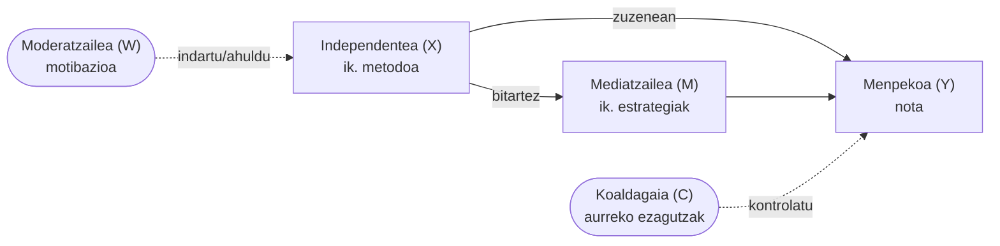

Errealitatea ezagutu nahi dugunean, datuak bildu eta aztertu behar ditugu. Horretarako, **aldagaiak** erabiltzen dira.

Aldagaia
:   Errealitatearen analisi egokia egiteko **neurtu daitekeen edozein ezaugarria**. Interpretazio zuzena egiteko, aldagaiaren **izaera** ondo ezagutu behar da.

## Datu motaren arabera

Bi bloke nagusi daude, eta bakoitzak **analisi deskriptibo** eta **inferentzialetan** erabili daitezkeen teknikak baldintzatzen ditu.

### Aldagai kategorikoak

Ezaugarri **kualitatiboak** neurtzen dituzte; balioak kategoriak dira, ez kantitateak.

Aldagai Nominala
:   Ordenarik gabeko kategoria da. Ez dago hierarkiarik balioen artean.
    *Adib.:* Ikasgaia, herrialdea, generoa.

Aldagai Ordinala
:   Ordena logikoa dauka, baina balioen arteko tartea ez da konstantea.
    *Adib.:* Gogobetetze-maila, hezkuntza-maila.

-   __📊 Nominalak__

    ---

    Ordenarik gabeko kategoriak. Ez dago hierarkiarik.

    - Ikasgaia *(Matematika, Historia…)*
    - Generoa, herrialdea

    **Deskribatzailea:** frekuentzia-taulak, bar-plot

    **Inferentziala:** Chi-karratua

-   __📈 Ordinalak__

    ---

    Ordena logikoa bai, baina tarte ez-konstantea.

    - Gogobetetze-maila *(1 = gutxi · 5 = asko)*
    - Hezkuntza-maila *(LH, DBH, Batxilergoa)*

    **Deskribatzailea:** proportzioak, bar-plot

    **Inferentziala:** Chi-karratua

### Aldagai zenbakizkoak

Balio **kuantitatiboak** dituzte; eragiketa matematikoak aplikatu daitezke.

Aldagai Diskretua
:   Zenbaki osoak soilik har ditzake; normalean kontaketa baten emaitza da.
    *Adib.:* Ikasle-kopurua, galdera-kopurua.

Aldagai Jarraitua
:   Tarte baten barruan edozein balio har dezake, desimalak barne.
    *Adib.:* Azterketa-denbora, pisua, tenperatura.

-   __📊 Diskretuak__

    ---

    Zenbaki osoak soilik; kontaketa baten ondorio.

    - Ikasle-kopurua klase batean
    - Galdera-kopurua test batean

    **Deskribatzailea:** batezbestekoa, mediana

    **Inferentziala:** T-test, ANOVA

-   __📈 Jarraituak__

    ---

    Tarte baten barruan edozein balio (desimalak barne).

    - Azterketa-denbora *(minutuetan)*
    - Pisua *(kg)*, tenperatura

    **Deskribatzailea:** histogramak, desbideratze estandarra

    **Inferentziala:** korrelazioa, erregresio-analisia

## Funtzioaren arabera

Aldagaiek ikerketa-ereduan betetzen duten **rola** ere sailkatu daiteke.

Aldagai Independentea
:   Menpekoan eragina izan dezakeen faktorea; ikerleak manipula dezake. *"Zergatik?"* galderari erantzuten dio.
    *Adib.:* Ikasketa-metodoa $(X)$.

Aldagai Menpekoa
:   Ikerketaren emaitza; beste aldagaiek eragiten diotena. *"Zer gertatzen da?"* galderari erantzuten dio.
    *Adib.:* Azterketako nota $(Y)$.

Koaldagaia
:   Ereduan kontrol gisa sartzen den aldagaia, efektu nagusia garbiago neurtzeko.
    *Adib.:* Aurreko ezagutzak $(C)$.

Aldagai Mediatzailea
:   $X$ eta $Y$ arteko harremana azaltzen duen mekanismoa. *"Nola"* gertatzen den erantzuten du.
    *Adib.:* Ikasketa-estrategiak $(M)$ gamifikazioaren eta notaren artean.

Aldagai Moderatzailea
:   $X$–$Y$ erlazioaren **indarra edo norabidea** aldatzen duen aldagaia. *"Noiz"* edo *"norentzat"* zehazten du.
    *Adib.:* Motibazioa $(W/Z)$.

**Aldagai motak funtzioaren arabera**

| Aldagai mota | Zer da? | Adibidea |
| --- | --- | --- |
| **Menpekoa** $(Y)$ | Aztertzen den emaitza; beste aldagaiek eragiten diotena | Azterketako nota |
| **Independentea** $(X)$ | Menpekoan eragina izan dezakeen faktorea; ikerleak manipula dezake | Ikasketa-metodoa |
| **Koaldagaia** $(C)$ | Kontrolatu beharreko faktorea, emaitzak ez distortsionatzeko | Aurreko ezagutzak |
| **Mediatzailea** $(M)$ | $X$ eta $Y$ arteko mekanismoa bitartekatzen duena (*"nola"*) | Ikasketa-estrategiak |
| **Moderatzailea** $(W/Z)$ | $X$–$Y$ erlazioaren indarra edo norabidea aldatzen duena (*"noiz"*) | Motibazioa |

!!! tip "Gako-galderak analisia diseinatzeko"
    1. *"Zer neurtu nahi dut?"* → **Menpekoa** $(Y)$
    2. *"Zerk eragiten dio?"* → **Independentea** $(X)$
    3. *"Zer kontrolatu behar dut?"* → **Koaldagaia** $(C)$
    4. *"Badago bitartekari bat?"* → **Mediatzailea** $(M)$ · **Moderatzailea** $(W/Z)$

??? info "GRAL-erako oharra"
    **Deskribatzailea:** aldagai mota bakoitzak estatistiko egokia eskatzen du — batezbestekoa kategorikoentzat ez du zentzurik; horren ordez, frekuentziak eta proportzioak erabili.

    **Inferentziala:** hipotesiek $X$ eta $Y$ arteko erlazioa zehaztu behar dute. Koaldagaiak ereduan sartu ezean, emaitzak distortsionatu daitezke.

## Aldagaiak izendatzeko urrezko arauak

**1. Beti letra batekin hasi**

Aldagai baten izena **inoiz ez da zenbaki batekin hasi behar**.

❌ Okerra  
`1adina`  
`2024_notak`

✅ Zuzena  
`adina`  
`nota_finala`

**Zergatik?**  
Programa estatistiko askok zenbaki batekin hasten diren izenak **balio matematiko edo errore gisa interpreta ditzakete**.

**2. Espaziorik EZ erabili**

Aldagaien izenetan **ezin dira espazioak erabili**.

❌ Okerra

`ikasle adina`  
`nota media`  
`ikasketa orduak`

✅ Zuzena

`ikasle_adina`  
`nota_media`  
`ikasketa_orduak`

💡 **Irtenbidea:**  
Erabili **beheko gidoia (_)** hitzak bereizteko.

**3. Ez erabili karaktere berezirik**

Karaktere bereziek arazoak sor ditzakete programa estatistikoetan.

❌ Okerra

`nota%`  
`urteañ`  
`motibazioa?`  
`nota-finala`

✅ Zuzena

`nota`  
`urtea`  
`motibazioa`  
`nota_finala`

Saihestu bereziki:

- `ñ`
- azentuak (`á é í ó ú`)
- ikurrak (`% ? ! / -`)

**4. Aurrizkiak (prefijoak) erabiltzea**

Praktika oso gomendagarria da **aurrizkiak erabiltzea**, aldagaien mota identifikatzeko.

Horrela, datu-basea **asko errazago interpretatzen da**.

 * **Datu demografikoak**

Aurrizkia: `dem_`

Adibideak:

`dem_adina` → ikaslearen adina  
`dem_sexua` → ikaslearen sexua  
`dem_herrialdea` → jatorrizko herrialdea  
`dem_maila` → ikasketa maila edo ikasturtea

* **Datu akademikoak**

Aurrizkia: `akad_`

Adibideak:

`akad_matematika_nota`  
`akad_euskara_nota`  
`akad_batezbestekoa`  
`akad_ikasketa_orduak`

* **balorazio edo eskala aldagaiak**

Aurrizkia: `val_`

Normalean **Likert eskalak** erabiltzen dira (1–5 edo 1–7).

Adibideak:

`val_motibazioa`  
`val_interesa`  
`val_gogobetetasuna`

Adibidez eskala:

| Balioa | Esanahia  |
| ------ | --------- |
| 1      | Oso baxua |
| 2      | Baxua     |
| 3      | Ertaina   |
| 4      | Altua     |
| 5      | Oso altua |

* **Interbentzio aurreko eta ondorengo neurketak**

Aurrizkiak:

`pre_` → interbentzioaren aurretik  
Post_`post_` → interbentzioaren ondoren

Adibideak:

`pre_matematika_nota`  
`post_matematika_nota`

`pre_motibazioa`  
`post_motibazioa`

Horrela azter daiteke **programa edo metodologia batek eragina izan duen ala ez**.

#### Adibide osoa: Hezkuntza ikerketa batean erabil daitezkeen aldagaiak

> [!NOTE] Adibidea
> Imajinatu ikerketa bat non aztertu nahi den ikasketa-metodo berri batek ikasleen errendimendua eta motibazioa hobetzen duen ala ez

-

*  **Aldagai demografikoak**

| Aldagaia       | Deskribapena          | Mota        |
| -------------- | --------------------- | ----------- |
| dem_sexua      | ikaslearen sexua      | nominala    |
| dem_adina      | ikaslearen adina      | zenbakizkoa |
| dem_herrialdea | jatorrizko herrialdea | nominala    |
| dem_maila      | ikasturtea            | ordinala    |

* **Aldagai akademikoak**

| Aldagaia             | Deskribapena                 | Mota        |
| -------------- | ---------------------------- | ----------- |
| akad_ikasketa_orduak | astean ikasten dituen orduak | zenbakizkoa |
| akad_matematika_nota | matematikako nota            | zenbakizkoa |
| akad_euskara_nota    | euskarako nota               | zenbakizkoa |
| akad_batezbestekoa   | batez besteko nota           | zenbakizkoa |

* **Eskala psikopedagogikoak**

Likert eskala (1-5):

| Balioa | Esanahia    |
| ------ | ----------- |
| 1      | Oso desados |
| 2      | Desados     |
| 3      | Neutrala    |
| 4      | Ados        |
| 5      | Oso ados    |

Aldagaiak:

`val_motibazioa`  
`val_interesa`  
`val_autoefikazia`

* **Interbentzio aurretik eta ondoren**

| Aldagaia             | Deskribapena                    |
| -------------------- | ------------------------------- |
| pre_matematika_nota  | programaren aurreko nota        |
| post_matematika_nota | programaren ondorengo nota      |
| pre_motibazioa       | motibazioa programaren aurretik |
| post_motibazioa      | motibazioa programaren ondoren  |
