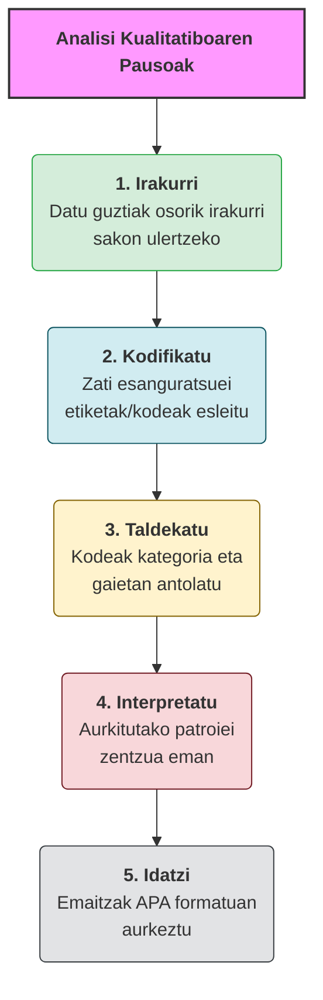

**Analisi kualitatiboa** da testuak, iritziak eta esperientziak ulertzeko prozesua {cite:p}`denzin2012a,jorrin2021`. Ez da zenbakiekin neurtzen: **esanahia** eta **patroiak** bilatzen dira {cite:p}`mcmillan2005,navarro2017`. Hezkuntza ikerketan ezinbestekoa da pertsonen errealitateak eta ikaskuntza-prozesuak sakontasunean ulertzeko {cite:p}`leon2003`.

:::{glossary}

Analisi kualitatiboa
: Testu, iritzi eta esperientzietan ezkutatzen diren **esanahiak eta patroiak** identifikatu eta ulertzeko ikerketa-prozesua. Zenbakiekin neurtu beharrean, interpretazioan oinarritzen da.

Dataset
: Ikerketa batean aztertuko den datu-multzoa. Analisi kualitatiboan, transkripzioek, egunkariek eta dokumentuek osa dezakete.

:::

---

## Analisi kualitatiboaren pausoak

Ondoko faseek osatzen dute analisi kualitatiboa. Hurrengo ataletan fase bakoitza zehatz-mehatz landuko dugu:

1. **Irakurri** — Datu guztiak osorik irakurri ulertzeko.
2. **Kodifikatu** — Zati esanguratsuei etiketa bat (kodea) esleitu.
3. **Taldekatu** — Kodeak kategoriatan eta gaietan antolatu.
4. **Interpretatu** — Aurkitutako patroiei zentzua eman.
5. **Idatzi** — Emaitzak APA formatuan aurkeztu.


---

```{admonition} Akats ohikoenak
:class: warning
❌ Elkarrizketak osorik kopiatzea\
❌ Laburpen hutsak egitea analisiaren ordez\
❌ Zitak ez erabiltzea frogatzeko\
❌ Deskribatzea soilik, interpretatu gabe
```

---

## Dataset-a (Praktikatzeko Materiala)

Ondorengo fitxategiak erabiliko ditugu ikastaro osoan zehar. Deskargatu eta QualCoder-en sartu:

- **Konpilazio osoa:** {download}`Dataset osoa <../assets/data/kualitatiboa/dataset-kualitatiboa.md>`
- {download}`Elkarrizketa 1 — Lehen Hezkuntza <../assets/data/kualitatiboa/2026-elkarrizketa-ir01.md>`
- {download}`Elkarrizketa 2 — Haur Hezkuntza <../assets/data/kualitatiboa/2026-elkarrizketa-ir02.md>`
- {download}`Elkarrizketa 3 — Lehen Hezkuntza <../assets/data/kualitatiboa/2026-elkarrizketa-ir03.md>`
- {download}`Gelako egunkaria <../assets/data/kualitatiboa/20260105-egunkaria-ikerlaria.md>`
- {download}`Programazio didaktikoa <../assets/data/kualitatiboa/2026-documentua-programazioa-didaktikoa-matematika-lh6.md>`